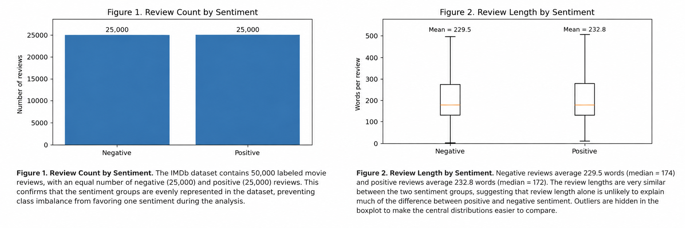

# Data Establishment & Metadata

## Data summary: 
This data was derived from Stanford's Large Movie Review dataset, which includes a total of 50,000 IMDb reviews. The data consists of written movie reviews 
and their associated sentiment labels, positive and negative. The data is divided evenly by sentiment between the test and train groups, each 25,000 reviews. 

## Provenance: 
Maas et al. created the dataset for sentiment-classification research and released it with their 2011 ACL paper [1]. The authors collected 50,000 labeled 
IMDb reviews, restricted the labeled sample to strongly polarized ratings, and allowed no more than 30 reviews for a single movie. Reviews rated 7-10 were treated as 
positive and reviews rated 1-4 as negative; neutral ratings were excluded to streamline classification. The labeled data were split evenly into training and testing sets.
Our group did not alter the review text or sentiment labels when converting the archive to CSV.

## License: 
The Stanford distribution page describes the dataset as publicly released for research and provides a required/recommended academic citation. We include this citation at the bottom of this page and on project README. For this project, we will use the dataset for educational analysis, preserve attribution to Maas et al. and IMDb, and link users to the Stanford source rather than representing the reviews as our own content. 

## Ethical statements: 
The observations are user-written movie reviews publicly-available on IMDb. The reviews are anonymized to keep users' identity hidden. 
We will analyze reviews in aggregate, avoid attempting to identify authors, and avoid reproducing long individual reviews in reports or presentations.

## Data dictionary: 

<table>
      <tr>
            <th>Feature</th>
            <th>Type</th>
            <th>Meaning</th>
            <th>Uncertainty</th>
      </tr>
      <tr>
            <td>Review_id</td>
            <td>Integer</td>
            <td>Identifier carried from the review filename</td>
            <td>Not globally unique by itself; interpret with split/sentiment context</td>
      </tr>    
      <tr>
            <td>Review</td>
            <td>Text</td>
            <td>Full written movie review</td>
            <td>May contain punctuation, capitalization, names, and other user-written variation</td>
       </tr>
      <tr>
            <td>Rating</td>
            <td>Integer</td>
            <td>IMDb rating associated with the review, ranges from 1-4 for negative and 7-10 for positive</td>
            <td>Ratings are 5-6 are intentionally absent from labeled data</td>
      </tr> 
      <tr>
            <td>Sentiment</td>
            <td>Positive/Negative</td>
            <td>Binary response variable</td>
            <td>Derived from rating thresholds</td>
       </tr>
      <tr>
            <td>Split</td>
            <td>Train/test</td>
            <td>Original benchmark partition</td>
            <td>Must be preserved to prevent test-set leakage</td>
       </tr>
      <tr>
            <td>Word Count</td>
            <td>Integer</td>
            <td>Number of whitespace-separated words in a review</td>
            <td>Engineered during EDA: tokenization choice can slightly change counts (not included in data)</td>
       </tr>
</table>

## Explanatory plots: 

*Figure 1 verifies that there is an even split of positive and negative sentiment among the 50,000 total reviews. Figure 2 shows that review length, or word count, is not a good indicator of sentiment. Negative and Positive reviews are generally very similar in length, supporting our investigation of specific language patterns within these reviews.*

References:

Maas, Andrew L. and Daly, Raymond E. and Pham, Peter T. and Huang, Dan and Ng, Andrew Y. and Potts, Christopher, “Learning Word Vectors for Sentiment Analysis,” Proceedings of the 49th Annual Meeting of the Association for Computational Linguistics: Human Language Technologies, p.142, June 2011. Available: http://www.aclweb.org/anthology/P11-1015.
